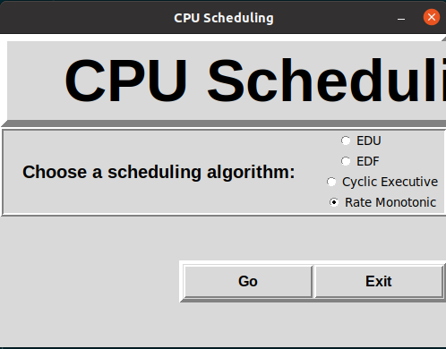
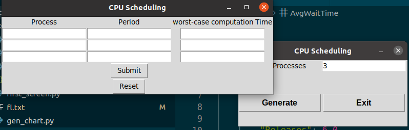
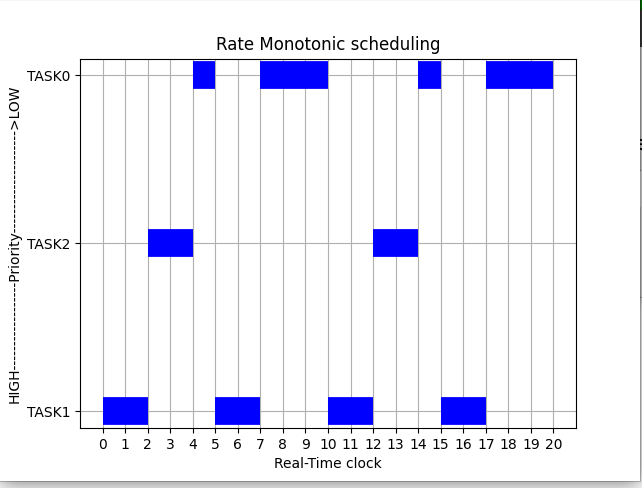

## scheduler project implemented in python

- to run the project  `python3 cpu_sheduler.py`

## usage example for rate monotonic scheduling

#  sample input 1 for rate monotonic

|        | Period  | WCET |
|:------:|:-------:|:----:|
| Task 1 |    20   |   8  |
| Task 2 |    5    |   2  |
| Task 3 |    10   |   2  |
## Gantt Chart output

## TODO 
- improve the user interface
- improve the alrogithm reliance
